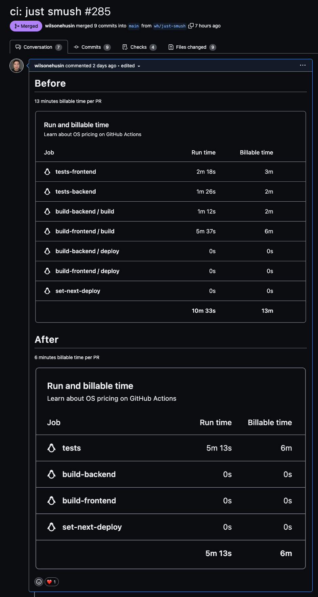


**Try it out!**

If you are more interested to have fun with the subject immediately, then [let some fun be had](https://github.com/wilsonehusin/smush). For more story on how things got here, read on!


> We are almost hitting the 3,000 minutes limit and we still have a week left.

I saw this message on day job's Slack workspace, which bothered me enough to investigate. I had set up our development team to use GitHub Actions as I have grown familiar with them while working on open source projects in the past few years, and it felt like a good idea to consolidate development needs since we already use GitHub for hosting source code repository.

Unfortunately, this was a wake up call for me that GitHub Actions unlimited minutes for open source projects had spoiled me to be wasteful of resources. As such, our CI on every commit was at 6 minutes run time, but 16 minutes billable time.


**Run time vs billable time**

In GitHub Actions, _run time_ is the amount of time used by a job / pipeline based on how much real-world time was consumed. It means when two jobs start at the same time, takes X minutes to finish, and then finishes at the same time, the run time is X minutes. Some nerds also refer to this as [wall time](https://en.wikipedia.org/wiki/Elapsed_real_time).

_Billable time_, on the other hand, is the amount of time that GitHub will count towards your GitHub Actions minutes usage. This calculation measures time of each job, such that two parallel job of X minutes would yield 2X minutes of billable time. Oh, and they [round up each job to the nearest whole minute](https://docs.github.com/en/billing/managing-billing-for-github-actions/about-billing-for-github-actions#:~:text=GitHub%20rounds%20the%20minutes%20and%20partial%20minutes%20each%20job%20uses%20up%20to%20the%20nearest%20whole%20minute.).


How could 6 minutes run time got translated to 16 minutes of billable time? Well, it adds up: I had parallelize several jobs which took less 1 minute, think about the many linters a given web application project has, and GitHub just round up 5 second job to 1 minute of billable time.

I had done what I thought is the all-round optimal solution, given that [GitHub Actions only supports parallelization at job level and not step level](https://github.com/orgs/community/discussions/26291). Now, I am confronted with reality that it was not a wise idea.

So now, I am working with these constraints:

- Jobs can be parallel, but not steps.
- Billable time is rounded up per job, not steps.
- Every step is just a Linux command.

Then an idea came up: GitHub may not officially parallel execution on step-level, but Linux does! And so, Smush was born.


**At what cost?**

When talking about _build vs buy_ scenarios like this one, there are very reasonable arguments to be made here on either:

- Just pay for more execution time credits
- Consolidate the jobs and run them linearly, an extra minute of run time is still not bad

And they are absolutely right! However, I thought about the solution right before embarking a 20 hour flight across the planet, so that was a nice distraction to prevent jet lag.


## Using Smush

Smush takes in a list of commands to run in parallel, then runs them in parallel. If any of the commands returns non-zero, then Smush will still finish all commands, before finally returning non-zero. One may choose to configure the maximum parallel commands being run at any given time. Here is an example from my development machine:

```yaml
# smush.yaml
---
commands:
  - name: ruff
    run: poetry run ruff .
  - name: prettier
    run: npx run prettier --check .
```

```shell-session
$ smush -c smush.yaml
     ruff |> poetry run ruff --show-source .
 prettier |> npx run prettier --check .
     ruff |> >>> exited 0
 prettier |> Checking formatting...
 prettier |> All matched files use Prettier code style!
 prettier |> >>> exited 0
```

From the output, you can notice that the commands were run concurrently, which maximizes the utility of multi-core CPUs. Now, going back to GitHub Actions context, the same configuration seemed to have a different output:

```shell-session
$ smush -c smush.yaml
     ruff |> poetry run ruff --show-source .
     ruff |> >>> exited 0
 prettier |> npx run prettier --check .
 prettier |> Checking formatting...
 prettier |> All matched files use Prettier code style!
 prettier |> >>> exited 0
```

It looked like the two commands were run linearly, one after the other, and indeed it was.

Smush automatically configures the maximum number of parallelization by _one less than number of cores_. This works great in most scenarios, except for machines with cores less than or equal to 2.

Unfortunately, GitHub Actions default runner is only 2 cores[^1], which is why we are not seeing the concurrent behavior here.

[^1]: At the time of writing, GitHub Actions large runners are available but limited to users in invite list. So if you are reading this from the future, consider bumping the runner spec if you desire so!

The good news is that we can tell Smush that we know what we're doing (or at least pretend to) and increase the parallelism anyway.

```shell-session
$ smush -c smush.yaml -p 2
     ruff |> poetry run ruff --show-source .
 prettier |> npx run prettier --check .
 prettier |> Checking formatting...
     ruff |> >>> exited 0
 prettier |> All matched files use Prettier code style!
 prettier |> >>> exited 0
```


**But how? _Why_?**

I would guess that the underlying infrastructure of GitHub Actions have hardware which consists of 2 threads per core, but on a virtualized setup, that information is propagated properly.

In my observation, 2 core 4 thread machines will usually show up as 4 processors in `/proc/cpuinfo`, thus resulting in Go's `runtime.NumCPU()` to return `4`. I wonder if GitHub Actions runner's infrastructure virtualization somehow returns 2 while the actual hardware processes it as if there are 4.

Don't quote me on this though, This is a hypothesis without knowing much of under the hood. If you have an alternative guess or would like to share what you know, [please drop me a line](mailto:wilson@husin.dev) and I would like to learn from you!



## Just Smush them

At day job, we had gone through several iterations of sub-par optimizations since the 16 minutes billable time mentioned above, before finally adopting Smush. The big delta is turning nearly **11 minutes of runtime down to less than 6 minutes**, while also dropping **13 minutes of billable time to 6 minutes**.



As an honorable mention, we also incorporated [casey/just](https://github.com/casey/just) to replace our 1-3 line of Bash files because writing `just lint-[linter]` is much more pleasant than finding the path to file which only gets used once.

## Reinventing the wheel

Smush is absolutely not the first tool to do such thing. I arrived to Smush after considering the following alternatives, which for the most part lacks ease of usage and / or readability. Smush aimed to be user-friendly, even to strangers!

That said, if you are already familiar with these tools, power to you! Smush is still around anyway and I would love to hear what you think of Smush.

- [GNU Parallel](https://www.gnu.org/software/parallel/): execution syntax looks complicated to me, who writes plenty of `xargs`, therefore I can't really recommend this to my team.
- Bash `wait` and `&`: better usage syntax readability than GNU Parallel, but hard to figure out if any of the jobs exited with non-zero.
