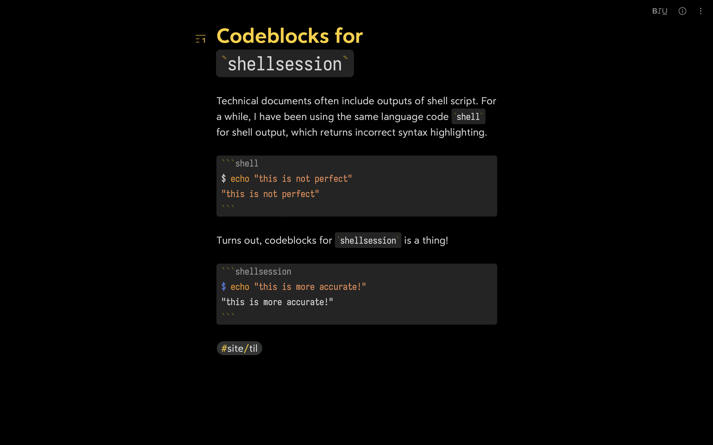
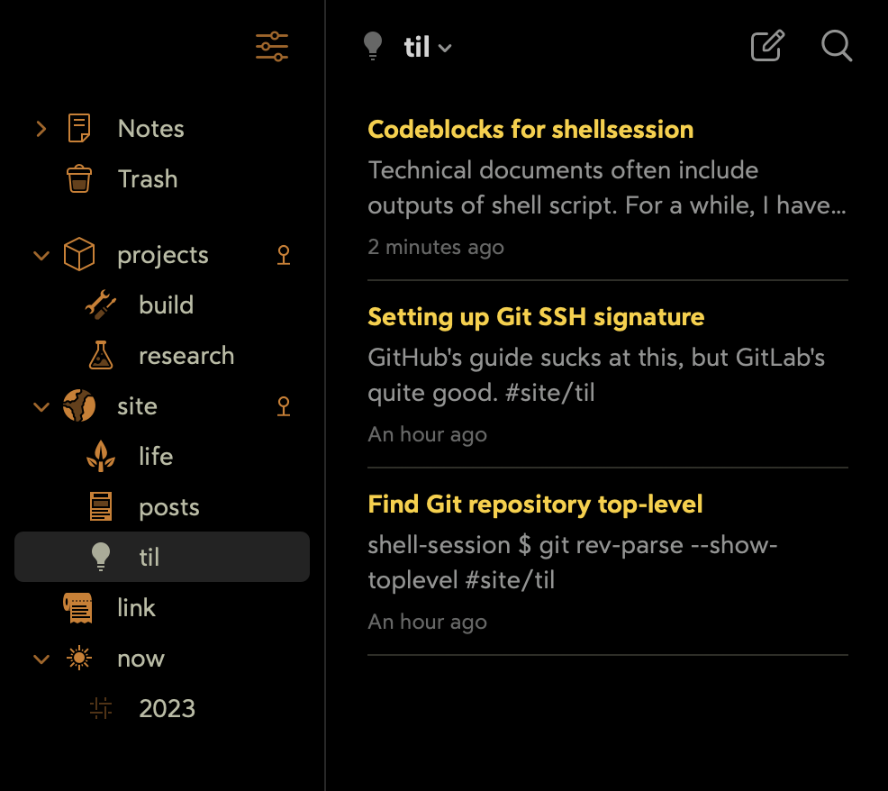

I figured it is time to consolidate my random notes which are scattered all over the place. Honestly, it has been time for a while.

My previous attempts include Apple Notes, Obsidian, and most recently HedgeDoc. There are many things to like about each, but none of them managed to capture critical mass of merit points to be the only medium for all my notes.

After trying out several options, I decided Bear deserves my attempt and let’s see how it fares over the next couple of months. Until then, this is my initial impression.

## Good stuff #1: View composition

Bear has editor-only (“zen”) mode which provides fantastic full screen experience for focused writing.

Bear also asks you to organize notes by tags, then reward you with tree-style list view for doing it, such that it resembles some sort of hierarchy.

## Good stuff #2: Excellent typography

Bear 2, which was shipped in 2023, came bundled with [Bear Sans](https://blog.bear.app/2023/08/learn-about-our-new-custom-font-bear-sans/). While I generally prefer more condensed glyphs, I have to admit it’s beautiful and I have not bothered changing it. I did, however, changed the monospace font to [Iosevka](https://github.com/be5invis/Iosevka).

On top of font customization, Bear also allows customization of line width & height as well as paragraph spacing & indent using `em`. Recently, I increasingly prefer defining `max-width` using `ch` in CSS, but just like the default font, it has not bothered me.

## Wishlist #1: Themes

While Bear offers many themes, majority of them are oriented towards light mode and many of the dark mode options do not have enough contrast.

_Dieci_ is the only one that provides enough contrast. _Dark Notes_ and _Dark Graphite_ have background colors which are still too bright for my eyes.

I found out that [one _can_ modify the themes by changing the application’s assets manually](https://beta.bear.app/t/custom-themes-exchange/11364), but it would break the consistency between devices, since I can’t imagine doing this hack on iOS.

## Wishlist #2: Content API

Bear documentation says that [the application uses SQLite under the hood](https://bear.app/faq/where-are-bears-notes-located/), which means one can get programmatic data out of it.

It would be nice to have content API where one can access data over HTTP, such that it can act as content management system (CMS).

Despite the limitations of Markdown syntax, I might prefer using this over any CMS editor that I have tried. However, the lack of HTTP content API makes me pause really hard on using Bear as the source for my blog.
